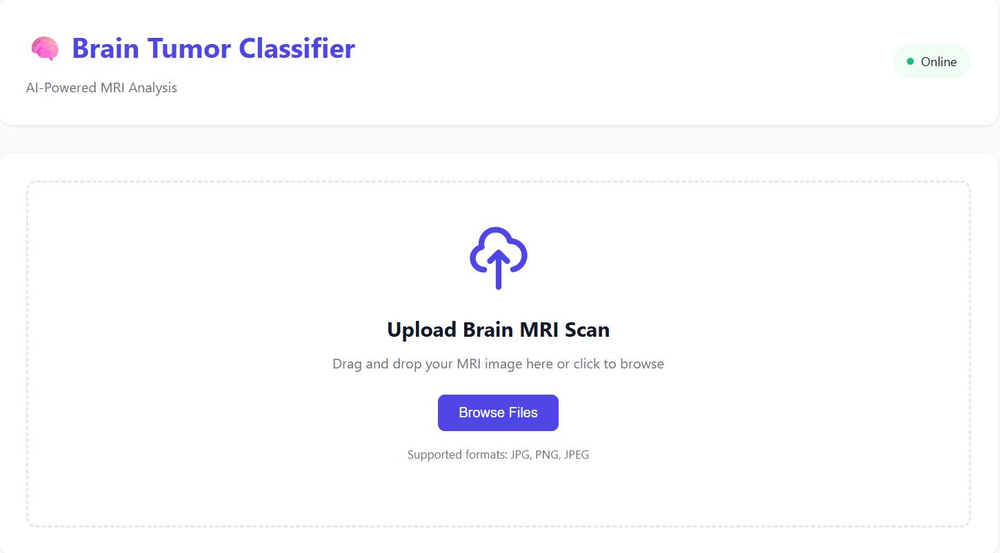
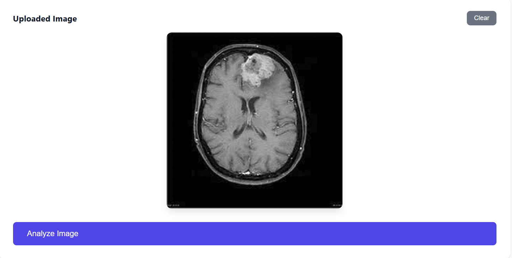
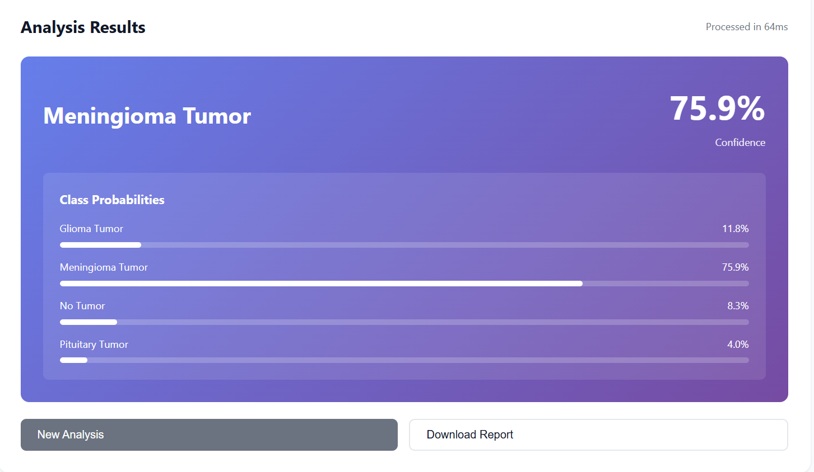

# 🧠 Brain Tumor Classification - Production MLOps Pipeline

[](https://www.python.org/downloads/)
[](https://fastapi.tiangolo.com)
[](https://www.docker.com/)
[](https://opensource.org/licenses/MIT)

> **Production-ready MLOps pipeline for automated brain tumor classification from MRI scans using deep learning.**

A complete end-to-end machine learning system featuring a FastAPI REST API, modern web interface, Docker containerization, CI/CD pipeline, and comprehensive monitoring. Built with industry best practices for deployment, scalability, and maintainability.

---

## Screenshots

### Web Interface

*Modern, responsive web interface for uploading and analyzing brain MRI scans*



### API Documentation

*Interactive Swagger UI for API testing and documentation*

### Prediction Results

*Real-time analysis with confidence scores and probability distributions*

---

## Features

### Core Capabilities
- **High-Accuracy Classification**: 96.7% validation accuracy on test dataset
- **Four Tumor Types**: Glioma, Meningioma, Pituitary, and No Tumor
- **Real-Time Predictions**: Average inference time < 500ms on CPU
- **Batch Processing**: Support for multiple image analysis

### User Interface
- **Modern Web App**: Drag-and-drop interface with live predictions
- **Prediction History**: Track and review past analyses
- **Visual Results**: Confidence scores with probability distributions
- **Export Reports**: Download detailed prediction reports

### API Features
- **RESTful API**: FastAPI-based with automatic documentation
- **Health Monitoring**: Real-time system status checks
- **Metrics Endpoint**: Performance and usage statistics
- **Async Support**: Non-blocking request handling

### MLOps & DevOps
- **Docker Containerization**: One-command deployment
- **CI/CD Pipeline**: Automated testing and deployment
- **Monitoring Stack**: Prometheus + Grafana + MLflow
- **Comprehensive Testing**: Unit and integration tests
- **Code Quality**: Automated linting and formatting

---

## Architecture
```
┌─────────────────────────────────────────────────────────┐
│                     Web Browser                         │
│            (React-like Vanilla JS Frontend)             │
└────────────────────┬────────────────────────────────────┘
                     │ HTTP/REST
                     ▼
┌─────────────────────────────────────────────────────────┐
│                   FastAPI Server                        │
│  ┌──────────────┐  ┌──────────────┐  ┌──────────────┐ │
│  │   Endpoints  │  │  Model Loader│  │  Monitoring  │ │
│  └──────────────┘  └──────────────┘  └──────────────┘ │
└────────────────────┬────────────────────────────────────┘
                     │
                     ▼
┌─────────────────────────────────────────────────────────┐
│              Enhanced 2D+1D CNN Model                   │
│  ┌──────────────────────────────────────────────────┐  │
│  │  ResNet18 Backbone (Transfer Learning)           │  │
│  │           ↓                                       │  │
│  │  2D CNN Enhancement (Domain Adaptation)          │  │
│  │           ↓                                       │  │
│  │  Channel & Spatial Attention Mechanisms          │  │
│  │           ↓                                       │  │
│  │  1D CNN Processing (Sequential Features)         │  │
│  │           ↓                                       │  │
│  │  Classification Head with Skip Connections       │  │
│  └──────────────────────────────────────────────────┘  │
└─────────────────────────────────────────────────────────┘
                     │
                     ▼
┌─────────────────────────────────────────────────────────┐
│              Monitoring & Logging                       │
│  ┌──────────┐  ┌──────────┐  ┌──────────┐            │
│  │Prometheus│  │  Grafana │  │  MLflow  │            │
│  └──────────┘  └──────────┘  └──────────┘            │
└─────────────────────────────────────────────────────────┘
```

---

## Model Performance

| Metric | Value |
|--------|-------|
| **Validation Accuracy** | 96.69% |
| **Architecture** | Enhanced 2D+1D CNN |
| **Backbone** | ResNet18 (ImageNet pre-trained) |
| **Input Size** | 224×224×3 |
| **Parameters** | ~12M |
| **Inference Time (CPU)** | ~450ms |
| **Inference Time (GPU)** | ~150ms |

### Class-wise Performance

| Class | Precision | Recall | F1-Score |
|-------|-----------|--------|----------|
| **Glioma** | 94.4% | 99.3% | 96.8% |
| **Meningioma** | 99.2% | 92.8% | 95.9% |
| **No Tumor** | 98.1% | 96.2% | 97.1% |
| **Pituitary** | 96.9% | 99.2% | 98.1% |

---

## Quick Start

### Prerequisites

- Python 3.9+
- Docker & Docker Compose (for containerized deployment)
- 4GB RAM minimum
- CUDA-capable GPU (optional, for faster inference)

### Local Development Setup
```bash
# 1. Clone the repository
git clone https://github.com/ValsamisP/Brain-Tumor-MLops.git
cd Brain-Tumor-MLops

# 2. Create virtual environment
python -m venv venv
source venv/bin/activate  # On Windows: venv\Scripts\activate

# 3. Install dependencies
pip install -r requirements.txt

# 4. Set environment variables (optional)
export MODEL_PATH="models/best_model.pth"  # Windows: $env:MODEL_PATH = "models/best_model.pth"

# 5. Run the application
python -m uvicorn app.main:app --reload --host 0.0.0.0 --port 8000

# 6. Open browser
# Web UI: http://localhost:8000
# API Docs: http://localhost:8000/docs
```
### Quick Commands (After Initial Setup)

```bash
# Navigate to project
cd Brain-Tumor-MLOPS

# Activate venv
venv/Scripts/Activate.ps1 # Windows
source venv/bin/activate # Mac/Linux

# Set model path
$env:MODEL_PATH = "models/best_model.pth" #Windows
export MODEL_PATH = "models/best_model.pth" # MAC/Linux

# Start Server
python -m uvicorn app.main:app --reload

# Open http://localhost:8000
```

### Docker Deployment
```bash
# Build and run with Docker Compose
docker-compose up -d

# Check status
docker-compose ps

# View logs
docker-compose logs -f api

# Stop all services
docker-compose down
```

**Note:** To create the docker image needs around 30-40 minutes.

**Access the services:**
-  **Web UI**: http://localhost:8000
-  **API Docs**: http://localhost:8000/docs
-  **Prometheus**: http://localhost:9090
-  **Grafana**: http://localhost:3000 (admin/admin)
-  **MLflow**: http://localhost:5000

---

##  Usage

### Web Interface

1. **Navigate** to http://localhost:8000
2. **Upload** a brain MRI scan (drag & drop or browse)
3. **Analyze** - Click the "Analyze Image" button
4. **View Results** - See prediction with confidence scores
5. **Download Report** - Export detailed analysis report

### API Usage

#### Python Example
```python
import requests

# Make prediction
with open('brain_scan.jpg', 'rb') as f:
    response = requests.post(
        'http://localhost:8000/predict',
        files={'file': f}
    )

result = response.json()
print(f"Prediction: {result['predicted_class']}")
print(f"Confidence: {result['confidence']:.2%}")
print(f"Probabilities: {result['probabilities']}")
```

#### cURL Example
```bash
# Single prediction
curl -X POST "http://localhost:8000/predict" \
  -H "accept: application/json" \
  -H "Content-Type: multipart/form-data" \
  -F "file=@brain_scan.jpg"

# Check health
curl http://localhost:8000/health

# Get metrics
curl http://localhost:8000/metrics
```

#### JavaScript Example
```javascript
const formData = new FormData();
formData.append('file', fileInput.files[0]);

const response = await fetch('http://localhost:8000/predict', {
    method: 'POST',
    body: formData
});

const result = await response.json();
console.log('Prediction:', result.predicted_class);
console.log('Confidence:', result.confidence);
```

---

##  Testing

### Run Tests
```bash
# Run all tests
pytest tests/ -v

# Run with coverage
pytest tests/ --cov=app --cov-report=html

# Run specific test file
pytest tests/test_api.py -v

# Run integration tests
pytest tests/integration/ -v
```

### Load Testing
```bash
# Install locust
pip install locust

# Run load test
locust -f tests/load_test.py --host http://localhost:8000
```

---

##  Project Structure
```
brain-tumor-mlops/
├── 📱 app/                          # Application code
│   ├── __init__.py
│   ├── main.py                     # FastAPI application
│   ├── model_loader.py             # Model loading & inference
│   ├── model_architecture.py       # Model imports
│   └── monitoring.py               # Metrics collection
│
├── 🎨 static/                       # Frontend assets
│   ├── css/
│   │   └── style.css              # UI styling
│   └── js/
│       └── app.js                 # Frontend logic
│
├── 📄 templates/                    # HTML templates
│   └── index.html                 # Main web interface
│
├── 🧠 src/                          # Model source code
│   └── models/
│       └── cnn.py                 # CNN architecture
│
├── 💾 models/                       # Model weights
│   └── best_model.pth             # Trained model (53MB)
│
├── 🧪 tests/                        # Test suite
│   ├── test_api.py                # Unit tests
│   └── integration/               # Integration tests
│
├── 📊 monitoring/                   # Monitoring configs
│   └── prometheus.yml             # Prometheus configuration
│
├── 🔧 scripts/                      # Utility scripts
│   ├── validate_model.py          # Model validation
│   └── smoke_tests.py             # Post-deployment tests
│
├── 🐳 Docker files
│   ├── Dockerfile                 # Container definition
│   ├── docker-compose.yml         # Multi-service setup
│   └── .dockerignore             # Docker ignore rules
│
├── 🔄 .github/workflows/            # CI/CD pipelines
│   └── ci-cd.yml                  # GitHub Actions workflow
│
├── 📚 Documentation
│   ├── README.md                  # This file
│   ├── SETUP_GUIDE.md            # Detailed setup instructions
│   └── QUICK_REFERENCE.md        # Command reference
│
└── ⚙️ Configuration
    ├── requirements.txt           # Python dependencies
    ├── pytest.ini                # Test configuration
    ├── .gitignore                # Git ignore rules
    └── Makefile                  # Convenience commands
```

---

##  Configuration

### Environment Variables
```bash
# Model configuration
MODEL_PATH=models/best_model.pth

# API configuration
API_HOST=0.0.0.0
API_PORT=8000
LOG_LEVEL=INFO

# Monitoring
PROMETHEUS_ENABLED=true
MLFLOW_TRACKING_URI=http://mlflow:5000
```

### Model Configuration

Edit `app/model_loader.py` to customize:
- Model path
- Device (CPU/GPU)
- Batch size
- Image preprocessing

---

##  Deployment

### Deploy to AWS EC2
```bash
# SSH into EC2 instance
ssh -i your-key.pem ec2-user@your-instance

# Clone repository
git clone https://github.com/ValsamisP/Brain-Tumor-MLops.git
cd Brain-Tumor-MLops

# Install Docker
sudo yum update -y
sudo yum install docker -y
sudo service docker start

# Run with Docker Compose
sudo docker-compose up -d

# Configure security groups to allow ports 8000, 9090, 3000, 5000
```

### Deploy to Google Cloud Run
```bash
# Build and push to Google Container Registry
gcloud builds submit --tag gcr.io/YOUR-PROJECT/brain-tumor-api

# Deploy
gcloud run deploy brain-tumor-api \
  --image gcr.io/YOUR-PROJECT/brain-tumor-api \
  --platform managed \
  --region us-central1 \
  --allow-unauthenticated \
  --memory 2Gi
```

### Deploy to Azure
```bash
# Create container registry
az acr create --resource-group brain-tumor-rg \
  --name braintumorregistry --sku Basic

# Build and push
az acr build --registry braintumorregistry \
  --image brain-tumor-api:latest .

# Deploy to Azure Container Instances
az container create \
  --resource-group brain-tumor-rg \
  --name brain-tumor-api \
  --image braintumorregistry.azurecr.io/brain-tumor-api:latest \
  --cpu 2 --memory 4 \
  --ports 8000
```

---

## Monitoring & Observability

### Prometheus Metrics

The API exposes Prometheus-compatible metrics at `/metrics`:

- `predictions_total` - Total number of predictions
- `prediction_duration_seconds` - Prediction latency
- `model_confidence_score` - Confidence distribution
- `class_distribution` - Prediction class counts

### Grafana Dashboards

Access Grafana at http://localhost:3000 (admin/admin)

**Pre-configured dashboards:**
- API Performance (request rate, latency, error rate)
- Model Performance (predictions, confidence, class distribution)
- System Resources (CPU, memory, disk)

### MLflow Experiment Tracking

Track experiments and model versions at http://localhost:5000

**Features:**
- Model versioning
- Experiment comparison
- Hyperparameter tracking
- Metric visualization

---

## Security

- ✅ Input validation on all endpoints
- ✅ File type restrictions (images only)
- ✅ Size limits on uploads (10MB max)
- ✅ CORS properly configured
- ✅ No credentials in code
- ✅ Dependency vulnerability scanning
- ✅ Docker security best practices

**For production:**
- Add authentication (OAuth2, JWT)
- Enable HTTPS/TLS
- Implement rate limiting
- Add request signing
- Regular security audits

---

##  Development

### Code Quality
```bash
# Format code
black app/ tests/
isort app/ tests/

# Lint code
flake8 app/ tests/
pylint app/

# Type checking
mypy app/
```

### Pre-commit Hooks
```bash
# Install pre-commit
pip install pre-commit

# Set up hooks
pre-commit install

# Run manually
pre-commit run --all-files
```

---

## Roadmap

- [ ] Add authentication & user management
- [ ] Implement A/B testing framework
- [ ] Add model explainability (GradCAM)
- [ ] Multi-language support
- [ ] Mobile app (React Native)
- [ ] Real-time collaboration features
- [ ] Automated model retraining pipeline
- [ ] Data drift detection
- [ ] Multi-model ensemble support
- [ ] Export to ONNX for edge deployment

---

## 📄 License

This project is licensed under the MIT License - see the [LICENSE](LICENSE) file for details.

---

##  Author

**Panagiotis Valsamis**


## 🙏 Acknowledgments

- **Research Foundation**: [Brain-Tumor-Classification-using-2D-1D-CNN](https://github.com/ValsamisP/Brain-Tumor-Classification-using-2D-1D-CNN) - Original research and model development
- **Dataset**: Brain MRI Images for Brain Tumor Detection
- **Frameworks**: FastAPI, PyTorch, Docker, Prometheus
- **Inspiration**: MLOps best practices from industry leaders
- **Community**: Open-source ML and DevOps communities

---

## ⚠️ Disclaimer

**This project is for educational and research purposes only.**

This system is **NOT** approved for clinical use or medical diagnosis. It should not be used as a substitute for professional medical advice, diagnosis, or treatment. Always seek the advice of qualified health providers with any questions regarding medical conditions.

The model's predictions should be verified by qualified medical professionals and used only as a supplementary tool in research settings.

